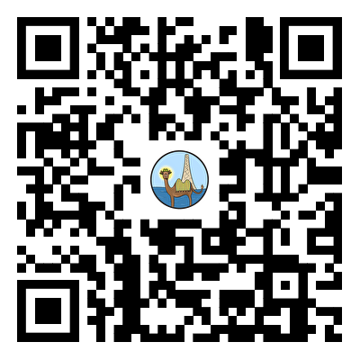

# CAMEL Agent Tutorial

## 项目简介

- 课程说明：CAMEL 是最早的[基于 LLM 的多智能体框架](https://arxiv.org/pdf/2303.17760.pdf)，现在是一个通用框架，用于构建和使用基于 LLM 的智能体来解决实际任务。**camel-agent-tutorial** 是一套专为那些期望深入了解并实践多智能体系统的开发者设计的实用指南。本教程基于国内领先的多智能体框架 CAMEL-AI（NeruIPS'2023），从最基本的单个Agent开发，逐渐尝试构建复杂的Multi Agent应用。
- 面向人群：
  - 本项目侧重点在实践和动手构建Agent应用的层面，但会将理论部分结合。适于对多智能体系统、大模型应用或人工智能领域有研究兴趣、希望通过实践了解并探索LLM在多智能体系统中应用的同学。
  - 通过这个项目，我们希望帮助开发者：
    1. **理解基础**：掌握CAMEL框架的使用方法，理解Agent的基本概念，为后续的学习使用打下坚实的基础。
    2. **提升技能**：设置一系列实践项目，涉及(RAG,Memory,Multi Agent)等，逐步提高开发者在构建和管理智能体方面的技能。
    3. **应用实践**：鼓励开发者将所学知识应用于解决实际问题，培养他们的实践能力和创新思维。
  - 技术基础：
    - XXXX
    - 适合拥有**Python编程基础**
    - 能**尝试阅读和理解项目源代码和理论**的学习者
  - 兴趣与动机：适合对AI智能体领域充满热情的学习者，特别是那些希望从代码层面对智能体进行个性化能力开发的人。我们的课程旨在帮助学习者将理论知识转化为实际应用。

教程在线阅读链接: https://fmhw1n4zpn.feishu.cn/docx/AF4XdOZpIo6TOaxzDK8cxInNnCe?from=from_copylink

CAMEL: https://github.com/camel-ai/camel

## 目录（暂定）

**第零章：序言**

**0.1 加入我们**

**0.2 如何贡献？**

---

**第一章：环境配置**

**1.1 获取 CAMEL**

> **1.1.1 通过源码安装**
>
> > - **1.1.1.1 使用 Poetry 工具从源码安装（推荐）**
> > - **1.1.1.2 使用 Conda 和 Pip 从源码安装**
>
> **1.1.2 通过 PyPI 安装**

**1.2 API 设置**

> **1.2.1 使用 OpenAI API**
>
> > - **1.2.1.1 获取 OpenAI API KEY**
> > - **1.2.1.2 类 Unix 系统（Linux / MacOS）**
> > - **1.2.1.3 Windows**

**1.3 Hello CAMEL!**

> **1.3.1 使用 OpenAI 模型**
>
> **1.3.2 使用其他模型以及不同的输出语言**

**1.4 第一章课程作业**

> - **基础作业**
> - **进阶作业**

---

**第二章：Agent 与 CAMEL 框架简介**

**2.1 智能体概述**

**2.2 Agent 设计原则与方法**

**2.3 CAMEL 框架简介**

> **2.3.1 什么是 CAMEL?**
>
> **2.3.2 Role Playing 机制**
>
> **2.3.3 基本概念**
>
> **2.3.4 ChatAgent 简介**
>
> **2.3.5 Workforce 简介**
>
> **2.3.6 CAMEL 中一些预设的智能体**

---

**第三章：Agent 的构成组件**

**3.1 Models**

> **3.1.1 目前支持的模型**
>
> **3.1.2 通过 API 调用模型**
>
> **3.1.3 使用开源模型**
>
> > - **3.1.3.1 使用 Ollama**
> > - **3.1.3.2 使用 VLLM**

**3.2 Messages**

> **3.2.1 概述**
>
> **3.2.2 创建和使用 Message**
>
> **3.2.3 不同类型消息的处理**
>
> **3.2.4 与 ChatAgent 协作**
>
> **3.2.5 Responses**
>
> **3.2.6 实践练习**

**3.3 Prompt Engineering**

> **3.3.1 概述**
>
> **3.3.2 怎么写好提示词？**
>
> **3.3.3 上下文学习 (ICL)**
>
> > - **3.3.3.1 什么是 ICL？**
> > - **3.3.3.2 ICL 基础原理**
>
> **3.3.4 思维链 (CoT)**
>
> > - **3.3.4.1 什么是 CoT？**
> > - **3.3.4.2 传统方法与 CoT 的区别**
> > - **3.3.4.3 CoT 的不同类型**
> > - **3.3.4.4 为什么 CoT 有效？**
>
> **3.3.5 CAMEL 中的 Prompt**
>
> > - **3.3.5.1 使用 CoT 提示词创建特定任务 Agent**
> > - **3.3.5.2 使用自定义 Prompt 模板**
> > - **3.3.5.3 使用 TextPrompt 类编写你的提示词**
>
> **3.3.6 实践练习**

**3.4 Memory**

> **3.4.1 简介**
>
> **3.4.2 ChatHistoryBlock**
>
> > - **3.4.2.1 keep_rate 概述**
>
> **3.4.3 VectorDBBlock**
>
> **3.4.4 CAMEL 中的具体实践**

**3.5 Tools**

> **3.5.1 工具说明**
>
> **3.5.2 动手实践**
>
> **3.5.3 进阶案例**

---

**第四章：CAMEL 框架下的多智能体协同**

**4.1 CAMEL Multi-Agent 系统介绍**

> **4.1.1 Single Agent**
>
> > - **4.1.1.1 基本概念**
> > - **4.1.1.2 简单实践**
>
> **4.1.2 Multiple Agent**
>
> > - **4.1.2.1 基本概念**

**4.2 创建你的第一个 Agent Society**

> **4.2.1 准备工作**
>
> **4.2.2 配置 Role-Playing 会话**

**4.3 创建你的 Workforce**

> **4.3.1 简单实践**
>
> **4.3.2 利用 Workforce 组建 Hackathon 评审团**

---

**第五章：CAMEL 框架下的 RAG 应用**

**5.1 RAG 的组件介绍**

> **5.1.1 RAG 简介**
>
> **5.1.2 Storages 介绍**
>
> > - **5.1.2.1 基本概念**
> > - **5.1.2.2 键值存储**
> > - **5.1.2.3 向量存储**
> > - **5.1.2.4 图存储**
>
> **5.1.3 Loaders**
>
> > - **5.1.3.1 基本概念**
> > - **5.1.3.2 Base IO**
> > - **5.1.3.3 Unstructured IO**

**5.2 搭建知识库**

> **5.2.1 Embedding 模型选择**
>
> **5.2.2 数据预处理**

**5.3 构建 RAG 应用**

> **5.3.1 Basic RAG**
>
> **5.3.2 Rewriting**
>
> **5.3.3 Rerank**

---

**第六章：综合案例**

> **6.1 单一智能体与自动 RAG 的结合**
>
> **6.2 多智能体与自动 RAG 的结合**

---

**结束语**

- **关注我们**
- **常见问题解答**

---

## Roadmap

- [x] 发布第一版内容内测
- [ ] 发布第一版内容公测
- [ ] 飞书内容迁移仓库
- [ ] 更新案例源代码文件
- [ ] 补充更多实例和新特性讲解。

## 参与贡献

- 如果你想参与到项目中来欢迎查看项目的 [Issue]() 查看没有被分配的任务。
- 如果你发现了一些问题，欢迎在 [Issue]() 中进行反馈🐛。
- 如果你对本项目感兴趣想要参与进来可以通过 [Discussion]() 进行交流💬
- 如果有任何想法可以联系我们 DataWhale&CAMEL 社区开发者，也欢迎大家多多提出 issue
- 特别感谢以下为教程做出贡献的同学！

## 贡献者名单

| 姓名   | 职责       | 简介                     |
| :----- | :--------- | :----------------------- |
| xxx | 项目负责人 | xxx |
| xxx | 核心贡献者 | xxx        |
| xxx | 核心贡献者 | xxx                |
| xxx | 核心贡献者 | xxx                |
| xxx | 核心贡献者 | xxx |
| xxx | 核心贡献者 | xxx                |
| xxx    | 贡献者     |                          |
| xxx    | 贡献者     |                          |

特别感谢[@Sm1les](https://github.com/Sm1les)对项目的帮助和支持~

## 关注我们

扫描下方二维码关注公众号：Datawhale

扫描下方二维码关注公众号：CAMEL-AI

## LICENSE

 本作品采用<a rel="license" href="http://creativecommons.org/licenses/by-nc-sa/4.0/">知识共享署名-非商业性使用-相同方式共享 4.0 国际许可协议</a>进行许可。

*注：默认使用CC 4.0协议，也可根据自身项目情况选用其他协议*
